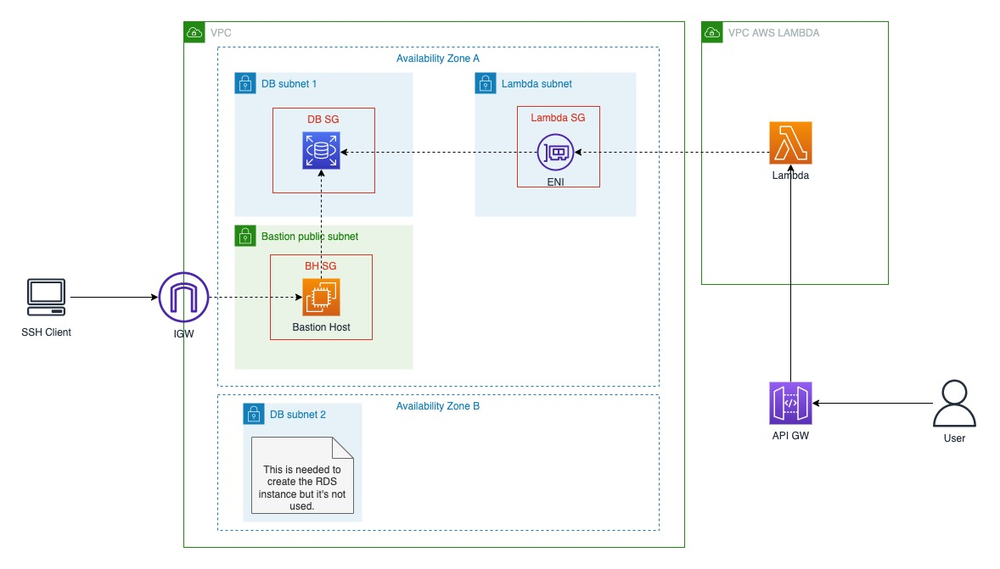

## aws-lambda-rds

This project is an example of how to set up AWS Lambda to access an Amazon RDS database privately.

It uses the `SAM` framework for managing the serverless application and `Terraform` to manage the rest of the 
infrastructure. The Lambda function is implemented in Java and an AWS API Gateway is created to be able to test this
function. It also creates a Bastion Host to access the RDS database from the localhost. 

## Tools

These are the tools needed for this project
- SAM CLI - [Install the SAM CLI](https://docs.aws.amazon.com/serverless-application-model/latest/developerguide/serverless-sam-cli-install.html)
- Java11 - [Install the Java 11](https://docs.aws.amazon.com/corretto/latest/corretto-11-ug/downloads-list.html)
- Maven - [Install Maven](https://maven.apache.org/install.html)
- Terraform - [Install Terraform](https://developer.hashicorp.com/terraform/tutorials/aws-get-started/install-cli)
- tfsec - [Install tfsec](https://aquasecurity.github.io/tfsec/v1.28.1/guides/installation/)
- Lombok - [Set up Lombok](https://projectlombok.org/setup/maven)
- Postgres 15
- curl

## Infrastructure

The following shows the infrastructure



## Deploy the project

To deploy the project you need an AWS account with permissions to the following services:
- IAM
- VPC
- EC2
- RDS
- S3
- Lambda
- API Gateway
- SSM Parameter Store
- Cloudformation
- DynamoDB
- EventBridge

### Deploying the infrastructure

The first thing you must do is to deploy the infrastructure using Terraform. You can find it inside the folder `terraform`.
The folder contains 3 folders: `environment`, `modules`, and `terraform-s3-backend`. It also contains a file named `tfsec.yml`
where the `tfsec` configuration is stored. The folder contains the following:
- `environment`: this contains the code to create all the AWS resources
- `modules`: this contains the Terraform modules
- `terraform-s3-backend`: this is to create an S3 terraform backend

The first step is to create the S3 backend using the `terraform-s3-backend` folder. For this you must run the command
`terraform apply` inside the folder. This creates an S3 bucket and a DynamoDB table. (You should change the S3 bucket 
name because it must be globally unique).

Once the S3 backend is created you may proceed to deploy what is inside the `environment` folder.
This creates all the resources depicted in the previous infrastructure diagram plus the following:
- EventBridge rules to stop and start the Bastion Host and the RDS instance at the end and start of the weekend respectively.
- S3 bucket for SAM
- SSM Parameter Store parameters

The second step is to change the following:
- The S3 backend configuration in `environment/main.tf` (in case you changed it in terraform-s3-backend)
- The Key Pair name to access the Bastion Host in `environment/dev.tfvars` (`bastion_host_key_name`)

Then you can run `terraform apply -var-file dev.tfvars` to deploy the infrastructure.

### Set up the RDS database

Once the infrastructure is deployed you should have an RDS instance created. Follow the next steps to set up the DB:
- Go to RDS in the AWS Console and set a master password (you can autogenerate one)
- Connect to the RDS instance (take the endpoint from Terraform output `db_instance_endpoint`)
  - _You can use the `tools/scripts/rds-ssh-tunnel.sh` script to create an SSH tunnel (you need to set the `ec2_instance_id` and
  `rds_endpoint` variables in the `rds-ssh-tunnel.properties`)_
- Create a database named `lambda_rds_test`
  ```SQL
    CREATE DATABASE lambda_rds_test;
  ```
- Create a user named `lambda_rds_db_user` and grant the DB role `rds_iam`
  ```SQL
    CREATE USER lambda_rds_db_user WITH LOGIN;
    GRANT rds_iam TO lambda_rds_db_user;
  ```
- Grant privileges to the `lambda_rds_db_user` user to the `public` schema on the `lambda_rds_test` database _(be sure to have selected the `lambda_rds_db_user` database)_
  ```SQL
    GRANT ALL PRIVILEGES ON ALL TABLES IN SCHEMA public TO lambda_rds_db_user;
    GRANT ALL PRIVILEGES ON ALL SEQUENCES IN SCHEMA public TO lambda_rds_db_user;
  ```
- Create tables _(be sure to have selected the `lambda_rds_db_user` database)_
  ```SQL
  CREATE TABLE book
  (
  id SERIAL CONSTRAINT book_pk PRIMARY KEY,
  name   VARCHAR(255) NOT NULL,
  author VARCHAR(255) NOT NULL
  );
  ```
- Populate the database _(be sure to have selected the `lambda_rds_db_user` database)_
  ```SQL
  INSERT INTO book(name, author)
  VALUES
      ('The Hobbit', 'J.R.R. Tolkien'),
      ('A Study in Scarlet', 'Arthur Conan Doyle'),
      ('The Lost Symbol', 'Dan Brown');
  ```

_For more information you can go [here](https://repost.aws/knowledge-center/rds-postgresql-connect-using-iam)._

### Deploy the SAM application

_The application deployment may take a while to deploy because of the Lambda access to the VPC_

Once the infrastructure is deployed and the RDS database is set up you can proceed to deploy the application. For that
you must do the following:
- Set the S3 bucket in the `samconfig.yaml` in the `s3_bucket` property under `default.deploy.parameters`. Use the
  `sam_cli_source_s3_bucket_name` from Terraform's output.
- Set the SSM Parameter Store parameters:
  - You can use the script `terraform/environment/set-ssm-parameters.sh` (run the script inside the `environment` folder)
  - Or you can set them manually as follows:
    - `/lambda-rds/db-endpoint`: value from Terraform output `db_instance_endpoint`
    - `/lambda-rds/db-iam-user`: **_lambda_rds_db_user_** (the DB user created a few moments ago)
    - `/lambda-rds/db-name`: **_lambda_rds_test_** (the DB created a few moments ago)
    - `/lambda-rds/db-resource-id`: value from Terraform output `db_instance_resource_id`
    - `/lambda-rds/security-groups`: value from Terraform output `lambda_functions_security_group_id`
    - `/lambda-rds/subnet-ids`: value from Terraform output `lambda_functions_subnet_id`
- On the root folder run `make build-deploy`
- To test the application execute the following curl command (you can also use another tool like Postman). 
_Replace `{LambdaRDSApi}` with the SAM's Cloudformation output of the same name_
```BASH
  curl {LambdaRDSApi}/java/book
```

### About the code

**IMPORTANT!!!** The code in the Lambda handler `get-java-handler` is meant only for testing purpose. You SHOULD NOT put
business logic inside a Lambda handler, instead you should create a separate module for that and can use a Lambda Layer to
put it.

The Lambda handler is written in Java, but it should work for other languages.

### tfsec
[tfsec](https://github.com/aquasecurity/tfsec) is a security scanner for Terraform code.

#### Usage
Run the following command inside the `terraform` folder:
```BASH
tfsec . --config-file ./tfsec.yml
```

### Future enhancements

Right now every time a Lambda function is created a new connection to the DB is created. This is not optimal. The solution
is to use an **_RDS Proxy_**.